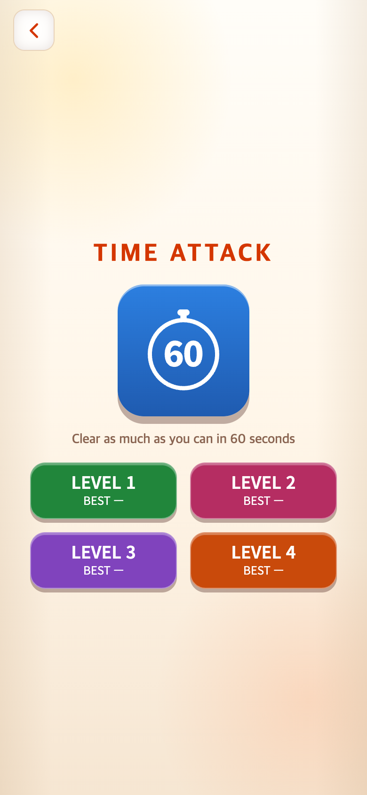

# 2026-09-06 — 연구기록 시작 및 현재 화면 기준본

## 근거와 범위

기준 게임 소스는 `6542a95`다. 문서는 2026-09-06에 Git 이력·코드·작업 대화를 근거로 작성한 **사후 개발 정리**다. 아래 과거 날짜는 Git 작성 날짜(KST)이며 당시 작성한 실험 일지가 아니다. 스크린샷은 이 커밋을 별도 임시 폴더에서 실행해 재촬영했으며, 사용자의 최종 요청에 따라 780×1688로 통일했다. 최초 1560×3376 자료는 이전 커밋 `9242bea`에 보존된다.

## 확인 가능한 주요 변경

| 날짜 | 커밋 | 변경과 요청 배경 |
|---|---|---|
| 09-02 | `4870f0a` | 로고 화면 이후 브라우저 위아래에 남던 주황 영역을 줄이기 위해 페이지 배경을 종이색으로 유지 |
| 09-02 | `881b497` | 사용자 제공 커버 이미지 교체 |
| 09-04 | `e9e9965` | 커버 전 스튜디오 로고 교체 |
| 09-06 | `4c5dbc0` | Noto Sans KR 가변 웹폰트 파일 추가 |
| 09-06 | `17db401` | 사용자 제공 로고로 갱신; 흰 글씨를 포함한 로고 전체 보존 요청 |
| 09-06 | `bbe8baa` | TAPtoTALK과 주요 UI 글꼴 스택 및 짧은 화면의 메뉴 타이포그래피 일치 |
| 09-06 | `162c406` | 모드 아이콘 SVG 세 개를 preload. 지연 완화 의도이며 전후 속도 측정 자료는 없음 |
| 09-06 | `0d3ee75` | How to Play의 정답 숫자 및 Next/Start에 금빛 반복 안내; 선택 후 해당 숫자 안내 해제 |
| 09-06 | `ae2d7cf` | 타임어택 4레벨, 레벨별 기록, 판 크기 진행, 같은 레벨 재시작 및 레벨 선택 복귀 |
| 09-06 | `6542a95` | 세 모드 아이콘 박스 크기 규칙 통일; 레벨 글씨 18px/600 |

Git 원문 확인: `git show <커밋>` 및 `git log --format=fuller`. 그 이전 개발 이력은 [WORKLOG](../../WORKLOG.md)와 기존 설계 문서에 남아 있으며 이번 기록이 전 역사를 재구성한 것은 아니다.

## 현재 설계

타임어택을 누르면 60초 아이콘 아래에 2×2 배치의 네 버튼이 나온다. LEVEL 1은 초록, 2는 짙은 분홍, 3은 보라, 4는 주황이다. 위 시계와 색이 겹치지 않도록 레벨 2의 파랑을 교체했다. 버튼에는 판 범위 대신 레벨과 BEST를 표시한다. 레벨 제목은 번들 `TAP Sans KR` 18px/600, 기록은 12px/400이다.

| 레벨 | 시작 → 진행 | 마지막 판 이후 |
|---|---|---|
| 1 | 2×2 → 3×3 → 4×4 | 4×4 반복 |
| 2 | 5×5 → 6×6 | 6×6 반복 |
| 3 | 7×7 → 8×8 | 8×8 반복 |
| 4 | 9×9 | 9×9 반복 |

전부 비우면 다음 크기로 진행한다. 더 이상 유효한 조합이 없으면 같은 크기의 새 판을 제공하며 클리어 횟수에는 포함하지 않는다. 판 전환 350ms 동안 입력·카운트다운을 잠시 멈춘다. 60초는 플레이 시간이며 벽시계 기준 전체 소요 시간은 전환/일시정지로 더 길 수 있다. 새 레벨 모드에는 기존 100점 타일 보충 및 500점 시간 연장 보상이 적용되지 않는다. 기존 최고점 필드는 보존하고 레벨별 최고점은 별도 배열에 저장한다.

How to Play는 다섯 연습판의 유효 조합을 계산해 아직 선택하지 않은 정답 숫자를 금빛으로 표시한다. 정답 이후 Next/Start가 빛난다. 움직임 줄이기 환경에서는 고정 테두리로 안내한다. 이 안내가 학습 속도·오류율을 개선하는지는 별도 참가자 실험이 필요하다.

## 검증과 촬영

- 이번 기록 작업에서 `npm test`: **128개 통과**, `npm run build`: 성공.
- 브라우저 캡처 스크립트는 네 레벨의 초기 타일 수 4/25/49/81과 튜토리얼 5단계 완료를 검사한다. 실행 완료 결과 및 이미지별 캡션/해시는 [manifest.json](manifest.json)을 참조한다.
- 새 브라우저 프로필로 기존 사용자 기록을 읽거나 변경하지 않았다. BEST —는 의도적으로 신규 기록 상태를 보여준다.
- 모바일 Chromium 에뮬레이션, 390×844 CSS px, DPR 2, 780×1688 PNG. 실제 휴대폰/Safari 검증이나 참가자 행동 관찰 자료가 아니다.
- 랜덤 함수와 브라우저 시계를 제어했다. 숫자 배치는 재현을 위한 것이며 일반 사용자의 무작위 플레이 표본이 아니다. 반짝임 PNG는 애니메이션 중 한 프레임이다.
- 화면 전환 중 반투명 상태가 그림에 남지 않도록 유한 애니메이션/전환을 완료한 후 캡처했다. 반복되는 안내 반짝임은 유지했다.
- 캡처 자동화는 정지된 애니메이션의 안정 대기 때문에 입력이 막히는 문제를 피하려고 강제 터치/클릭을 사용한다. 게임의 실제 입력 핸들러를 통하지만 자동화의 일반 안정성 검사를 생략한다.

## 화면 목록

원본은 모두 `screenshots/`에 있다. 정확한 파일명·캡션은 manifest에 포함된다.

| 구분 | 내용 |
|---|---|
| 01–03 | 스튜디오 로고, 커버, 메인 메뉴 |
| 04 | 레벨 선택 및 신규 최고기록 표시 |
| 05–08 | 네 레벨 초기 게임판 |
| 09–10 | 엔드리스·타임리스 안내 및 초기 게임판 |
| 11 | 튜토리얼 5단계 안내 |
| 12 | 튜토리얼 첫 성공과 Next 안내 |

## 후속 연구 자료

이번 기준본 이후에는 수정 전후를 같은 조건으로 추가한다. 과거 버전의 전후 스크린샷 전체 복원, 레벨별 참가자 성과, 게임 세션 로그, 기기별 가독성 평가, 로딩 속도 비교는 이번 자료에 포함되지 않았다. 당시 자료가 없는 수치나 설계 의도를 만들어 보충하지 않는다.
