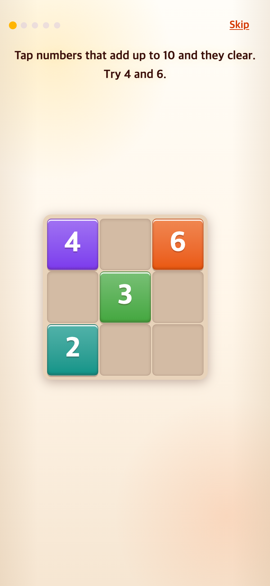
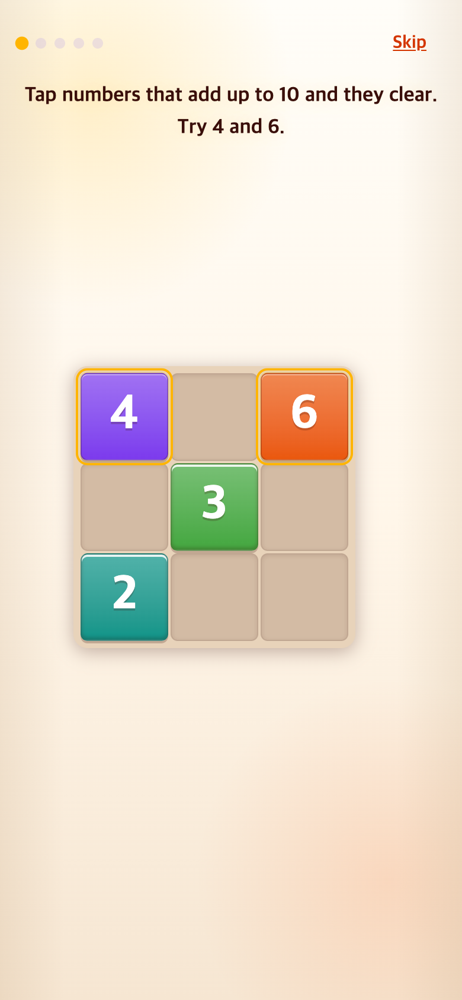

# 2026-09-06 — 튜토리얼 금빛 안내

## 문제·개선 요구

TAPtoTALK처럼 눌러야 할 곳을 반짝이게 표시해 달라는 사용자 요청이 있었다.

## 무엇을 왜 수정했는가

정답 숫자 중 미선택 숫자와 성공 후 Next/Start에 반복 효과를 적용했다.

## 수정 후 변화

정답 위치를 시각적으로 알 수 있게 됐다. 학습 효과를 측정한 사용자 실험은 아니다.

## 전후 모바일 화면

| 이전 162c406 | 이후 0d3ee75 |
|---|---|
|  |  |

## 근거와 재현 조건

이 문서는 Git 커밋 설명·소스 변경과 최근 작업 대화를 바탕으로 사후 정리했다. 당시 문제의 빈도나 학습 효과를 새로 측정한 것이 아니다. 커밋 원문과 전체 번호, 촬영일, 해시, 화면 상태는 [evidence.json](evidence.json)에 있다.

**과거 커밋을 이번에 재현한 화면**이다. 390×844 CSS px, DPR 2, 780×1688 PNG, Chromium 모바일 에뮬레이션을 사용했다. 별도 임시 폴더에서 git archive를 실행했고 당시 소스는 고치지 않았다. 현재 설치된 Vite/Playwright를 실행 도구로 사용했으므로 당시 잠금파일 환경 전체를 재현한 것은 아니다. 새 프로필·같은 난수 초기값·제어된 시계를 사용했지만 버전별 생성 알고리즘이 달라 숫자 배치까지 같지는 않을 수 있다. 화면 전환은 완료하고 반복 안내 효과는 유지했다. UI 경로가 도입되거나 사라진 경우 화면 종류도 달라진다.

커밋 메시지의 과거 테스트·시뮬레이션 수치는 작성자의 당시 기록이며 이번에 재검증한 결과가 아니다. 특히 4870f0a는 일부 과거 브라우저 테스트 보고를 정정한다. Safari 브라우저 외곽, Android 네이티브 실행 및 소리·동영상 재생의 실기기 품질은 PNG로 입증하지 않는다.
