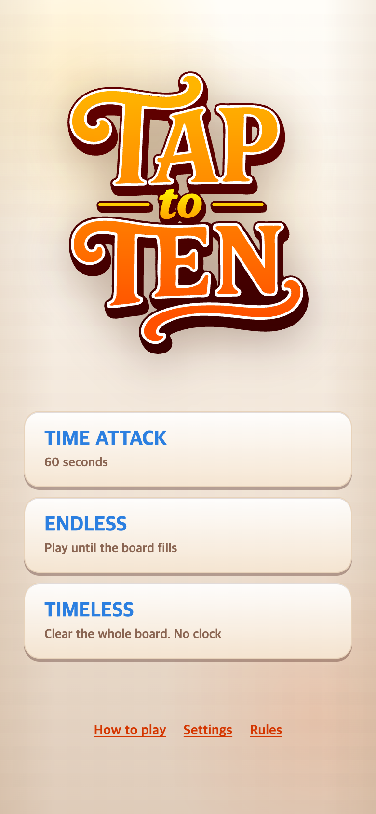
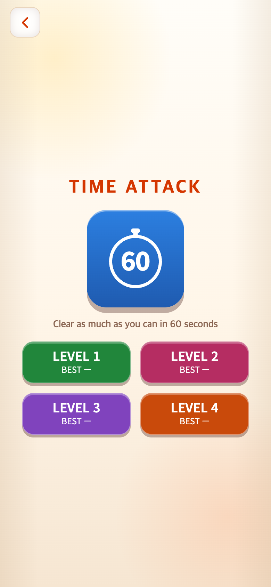
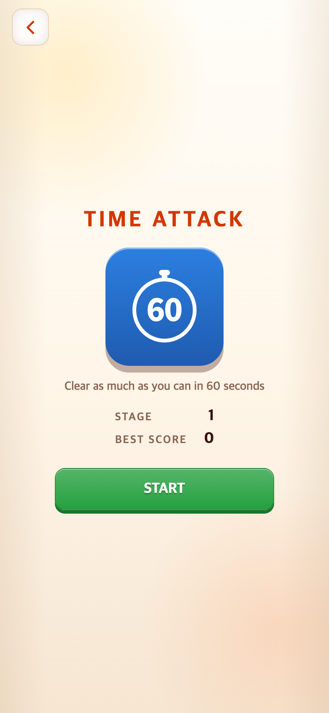
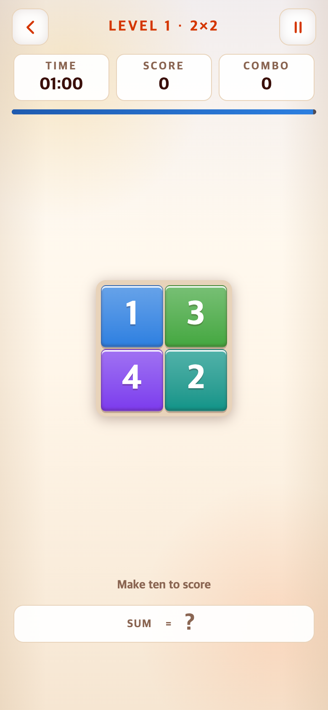
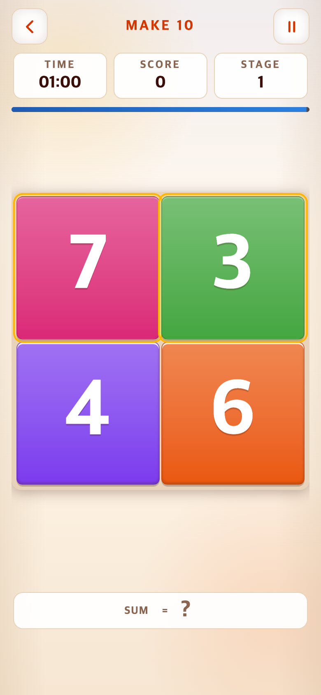

# 2026-09-08 — 타임어택에 학습 단계 통합

## 요청과 수정 이유

사용자는 별도 How to Play 대신 실제 게임에서 합계 10 규칙을 자연스럽게 배우는 긴 진행을 요청했다. 기존 네 레벨 선택을 START로 되돌리고, 9×9 판이 차지하던 공간에 큰 2×2 숫자를 표시한다. 문장형 안내 대신 상단 MAKE 10만 사용하며 60초 제한은 유지한다. 시간 종료 후에는 도달한 스테이지부터 새 60초로 이어가는 계획을 승인했다.

## 변경 내용

- 메인·설정의 How to Play 진입 버튼 제거. 이전 튜토리얼 소스와 역사 자료는 보존하지만 실행 앱에서 튜토리얼 컨트롤러를 불러오지 않는다.
- 타임어택 시작 화면을 START 하나, 저장된 STAGE 및 새 진행 방식의 BEST SCORE로 변경. 과거 레벨별 기록은 보존하고 새 기록 필드로 분리한다.
- 첫 세 판은 `[7,3,4,6]`, `[8,2,9,1]`, `[5,5,6,4]`. 두 숫자씩 합계 10으로 전체를 비운다. 첫 두 판에 정답 조합을 은은하게 표시한다.
- 4~5단계는 `[2,4,4]` 또는 `[3,3,4]` 조합을 세 묶음 제공해 두 숫자 조합만으로 해결할 수 없게 구성한다. 6단계에는 네·다섯 숫자 조합이 필요한 판을 넣고 이후 혼합 조합으로 확장한다.
- 3×3부터 크기마다 12단계: 4~15는 3×3, 16~27은 4×4, 28~39는 5×5, 40~51은 6×6, 52~63은 7×7, 64~75는 8×8, 76부터 9×9로 계속 진행한다. 후반은 합계 10 그룹으로 생성한 무작위 판이다. 이 단계 수는 초기 구현값이며 학습 실험으로 결정한 수치가 아니다.
- 모두 비우면 단계 상승. 막히면 같은 단계에 새 판을 제공한다. 전환 500ms 동안 시간·입력을 멈춘다. 60초는 실제 플레이 시간으로 이어지며 점수로 시간을 연장하지 않는다.
- 10 초과 시 숫자를 빨갛게 표시하고 판을 흔들며 `7 + 4 = 11 · TRY AGAIN`처럼 짧게 결과를 알린다. 숫자는 유지하고 선택만 해제한다.
- 진행 단계와 최고점은 로컬 저장소에 보존한다. 다음 START/결과의 Continue는 저장된 단계의 새 판·새 60초·0점으로 시작한다. 미완료 판의 선택 상태 자체를 복원하는 것은 아니다.

## 전후 화면

| 변경 전 (`490e323`) | 변경 후 (이 기록과 같은 변경 세트) |
|---|---|
|  |  |
|  |  |
|  |  |

추가 화면: [오답](after-over-ten.png), [3×3 진입](after-stage4.png), [이어하기](after-continue-intro.png), [9×9 테스트 상태](after-stage76-fixture.png).

## 검증과 한계

`npm test` 131개 통과, 프로덕션 빌드 성공. 새 핵심 테스트는 세 쌍 연습판 → 3×3 전환, 1~100단계 초기 판의 전체 클리어 가능성, 9×9 도달 및 지속, 오답·전환 입력 차단·60초 유지와 이어하기 설정을 검사한다. 실제 사용자의 학습 성공률이나 장기 난도 적절성을 검증한 실험은 아니다.

브라우저 확인 항목과 원본 해시는 [verification.json](verification.json), 재현 스크립트는 [check.mjs](check.mjs)에 있다. `node docs/research/2026-09-08-integrated-learning/check.mjs`로 재실행한다. 확정된 기존 자료를 덮어쓰지 않도록 후속 검사는 별도 폴더에 둔다.

전후 390×844 CSS px / DPR 2, **780×1688 PNG**, 동일 Chromium·신규 프로필·난수 초기값·제어 시계를 사용했다. 과거 화면은 해당 커밋을 임시 폴더에 git archive로 추출해 재현했다. 변경 후는 현재 작업 소스다. 유한 애니메이션은 완료한 프레임으로 촬영하므로 흔들림의 운동 자체는 PNG로 보이지 않는다. 강제 터치는 정지된 애니메이션의 안정성 대기를 생략하지만 실제 입력 핸들러를 통한다.

9×9 캡처는 **검증용으로 신규 테스트 프로필의 저장 단계를 76으로 설정한 화면**이며 실제 75개 판을 플레이한 결과가 아니다. 3×3까지는 실제 터치로 첫 세 판을 해결했다. 다른 게임의 저장소·실사용자의 기록은 변경하지 않았다.
